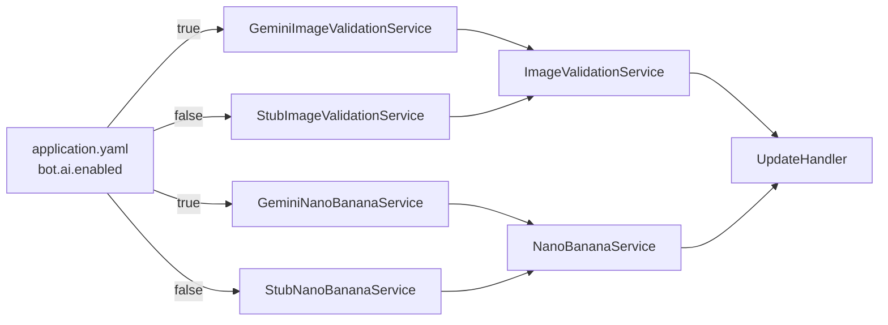
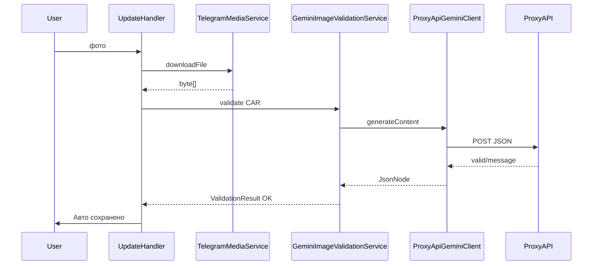
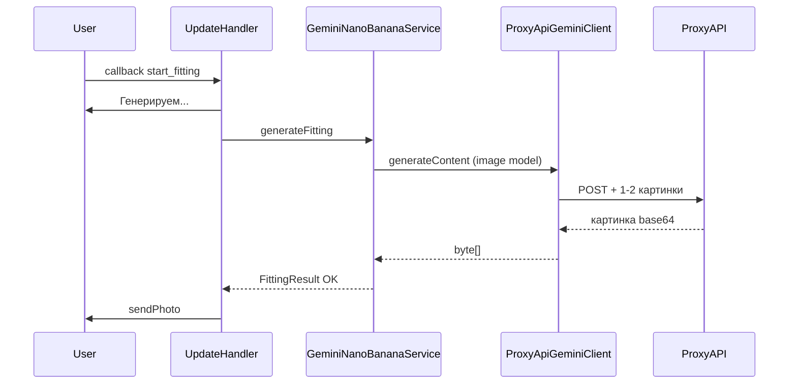
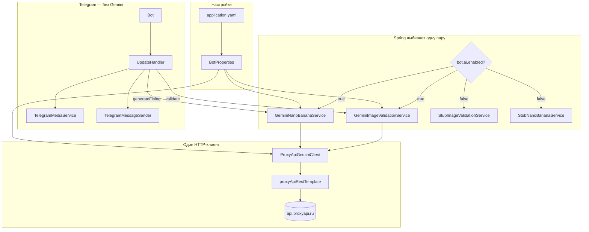

# Как в AiTuningBot подключён Gemini — разжёвано до мелочей

> **Для кого:** если после других гайдов всё ещё «нихуя не понятно».  
> **Тема одна:** где лежит Gemini, как он включается, кто кого вызывает, что улетает в интернет.

Связанные файлы:
- [PROJECT-GUIDE.md](./PROJECT-GUIDE.md) — обзор всего бота
- [PROJECT-GUIDE-DETAILED.md](./PROJECT-GUIDE-DETAILED.md) — весь UpdateHandler по блокам

---

## Содержание

1. [Главная мысль за 30 секунд](#1-главная-мысль-за-30-секунд)
2. [Почему не Google напрямую, а ProxyAPI](#2-почему-не-google-напрямую-а-proxyapi)
3. [Все файлы, которые относятся к Gemini (список)](#3-все-файлы-которые-относятся-к-gemini-список)
4. [Шаг 0: включение в application.yaml](#4-шаг-0-включение-в-applicationyaml)
5. [Шаг 1: BotProperties — настройки в Java](#5-шаг-1-botproperties--настройки-в-java)
6. [Шаг 2: Spring — как включается Gemini и выключается заглушка](#6-шаг-2-spring--как-включается-gemini-и-выключается-заглушка)
7. [Шаг 3: ProxyApiGeminiClient — единственный, кто ходит в сеть](#7-шаг-3-proxyapigeminiclient--единственный-кто-ходит-в-сеть)
8. [Шаг 4: проверка фото — GeminiImageValidationService](#8-шаг-4-проверка-фото--geminiimagevalidationservice)
9. [Шаг 5: примерка — GeminiNanoBananaService](#9-шаг-5-примерка--gemininanobananaservice)
10. [Шаг 6: UpdateHandler — где бот «тыкает» в AI](#10-шаг-6-updatehandler--где-бот-тыкает-в-ai)
11. [Два полных пути: фото авто и кнопка «Примерка»](#11-два-полных-пути-фото-авто-и-кнопка-примерка)
12. [Примеры JSON: что уходит и что приходит](#12-примеры-json-что-улетает-и-что-приходит)
13. [Ошибки: что увидишь в боте и где копать](#13-ошибки-что-увидишь-в-боте-и-где-копать)
14. [Как отключить Gemini и тестить меню бесплатно](#14-как-отключить-gemini-и-тестить-меню-бесплатно)
15. [Шпаргалка на одной странице](#15-шпаргалка-на-одной-странице)

---

## 1. Главная мысль за 30 секунд

**Gemini в боте = 3 слоя:**

```
application.yaml          ← тут ключ и «включить AI: да/нет»
        ↓
два «умных» сервиса       ← проверка фото + рисование примерки
        ↓
ProxyApiGeminiClient      ← ОДИН курьер в интернет (ProxyAPI)
        ↓
api.proxyapi.ru/google    ← там сидит Gemini
```

**UpdateHandler (меню) Gemini не знает.** Он говорит:
- «проверь фото» → `imageValidationService.validate(...)`
- «сделай примерку» → `nanoBananaService.generateFitting(...)`

А Spring под капотом подставляет классы с Gemini, если в yaml `bot.ai.enabled: true`.

---

## 2. Почему не Google напрямую, а ProxyAPI

| Если ходить напрямую | Если через ProxyAPI (как у нас) |
|----------------------|----------------------------------|
| URL: `generativelanguage.googleapis.com` | URL: `api.proxyapi.ru/google` |
| Ключ Google AI Studio | Ключ с сайта proxyapi.ru (`sk-...`) |
| Из РФ часто блок / VPN | Работает без VPN, оплата в рублях |
| Формат API тот же | Формат API **тот же** (метод `generateContent`) |

То есть в коде мы делаем **ровно то**, что пишут в доке Google Gemini — только **базовый адрес** и **ключ** другие.

Документация ProxyAPI: https://proxyapi.ru/docs/gemini-text-generation

---

## 3. Все файлы, которые относятся к Gemini (список)

Путь от корня проекта: `src/main/java/org/example/telgrambotaiassistant/`

| № | Файл | Роль одной фразой |
|---|------|-------------------|
| 1 | `src/main/resources/application.yaml` | Ключ, URL, модели, `enabled: true/false` |
| 2 | `configuration/BotProperties.java` | Java-объект с полями из yaml |
| 3 | `configuration/AiTuningBotConfig.java` | Подключает BotProperties + ObjectMapper |
| 4 | `configuration/ProxyApiGeminiRestTemplateConfig.java` | HTTP-клиент с таймаутом 180 сек для AI |
| 5 | `gemini/ProxyApiGeminiClient.java` | **Все** запросы в ProxyAPI/Gemini |
| 6 | `validation/ImageValidationService.java` | Интерфейс «проверить фото» |
| 7 | `validation/GeminiImageValidationService.java` | Реализация через Gemini |
| 8 | `validation/StubImageValidationService.java` | Заглушка без AI |
| 9 | `validation/BasicImageValidator.java` | Проверка размера файла без сети |
| 10 | `generation/NanoBananaService.java` | Интерфейс «сделать примерку» |
| 11 | `generation/GeminiNanoBananaService.java` | Реализация через Gemini |
| 12 | `generation/StubNanoBananaService.java` | Заглушка: вернуть то же фото авто |
| 13 | `generation/FittingRequest.java` | Что передаём в генерацию (байты авто, дисков, каталог) |
| 14 | `generation/FittingResult.java` | Успех/ошибка + байты картинки |
| 15 | `handler/UpdateHandler.java` | **Вызывает** валидацию и генерацию (2 строки) |

**Не относятся к Gemini, но рядом:** `Bot.java`, `TelegramMediaService` (качает фото **из Telegram**, не из Google).

---

## 4. Шаг 0: включение в application.yaml

Файл: `src/main/resources/application.yaml` (в git не коммитится, есть пример `application.yaml.example`).

```yaml
bot:
  ai:
    enabled: true                              # ← ГЛАВНЫЙ РУБИЛЬНИК
    api-key: ВАШ_КЛЮЧ_С_PROXYAPI              # ← без него запросы не пойдут
    base-url: https://api.proxyapi.ru/google   # ← куда стучимся
    validation-model: gemini-2.5-flash         # ← проверка фото
    generation-model: gemini-2.5-flash-image   # ← картинка примерки
```

### Что будет, если поменять

| Параметр | `true` / значение | Что произойдёт |
|----------|-------------------|----------------|
| `enabled` | `false` | Работают **Stub*** — Gemini **не вызывается** вообще |
| `enabled` | `true` | Работают **Gemini*** — идут запросы в ProxyAPI |
| `api-key` | пусто | Бот напишет «не настроен ключ» |
| `validation-model` | старая модель (`gemini-2.0-flash`) | Может быть `Model not supported` у ProxyAPI |
| `generation-model` | не image-модель | Модель вернёт текст, а не картинку → ошибка примерки |

**Перезапуск:** после правки yaml нужно **перезапустить** приложение в IDEA.

---

## 5. Шаг 1: BotProperties — настройки в Java

Файл: `configuration/BotProperties.java`

```java
@ConfigurationProperties(prefix = "bot")
public class BotProperties {
    private Ai ai = new Ai();

    public static class Ai {
        private boolean enabled = false;
        private String apiKey = "";
        private String baseUrl = "https://api.proxyapi.ru/google";
        private String validationModel = "gemini-2.5-flash";
        private String generationModel = "gemini-2.5-flash-image";
        // ...
    }
}
```

**Как это работает:**
- Spring при старте читает yaml.
- Строка `bot.ai.api-key` → поле `apiKey` (дефис в yaml = camelCase в Java).
- Любой сервис может попросить `BotProperties` в конструкторе и читать `botProperties.getAi().getValidationModel()`.

Подключение properties:

```java
// AiTuningBotConfig.java
@EnableConfigurationProperties(BotProperties.class)
```

---

## 6. Шаг 2: Spring — как включается Gemini и выключается заглушка

### Проблема

Есть **интерфейс** `ImageValidationService` и **две** реализации:
- `GeminiImageValidationService` — с AI
- `StubImageValidationService` — без AI

Если обе всегда в памяти — Spring не поймёт, какую вставить в `UpdateHandler`.

### Решение — аннотация `@ConditionalOnProperty`

**Gemini-версия** (живёт только при `enabled=true`):

```java
@Service
@ConditionalOnProperty(prefix = "bot.ai", name = "enabled", havingValue = "true")
public class GeminiImageValidationService implements ImageValidationService { ... }
```

**Заглушка** (живёт при `enabled=false`, это значение по умолчанию):

```java
@Service
@ConditionalOnProperty(prefix = "bot.ai", name = "enabled", havingValue = "false", matchIfMissing = true)
public class StubImageValidationService implements ImageValidationService { ... }
```

То же самое для `GeminiNanoBananaService` / `StubNanoBananaService`.



**UpdateHandler пишет:**

```java
private final ImageValidationService imageValidationService;
private final NanoBananaService nanoBananaService;
```

Он **не импортирует** `GeminiImageValidationService` — только интерфейс. Spring сам подставит нужную реализацию.

---

## 7. Шаг 3: ProxyApiGeminiClient — единственный, кто ходит в сеть

Файл: `gemini/ProxyApiGeminiClient.java`  
Аннотация: `@Component` — всегда создаётся (даже если AI выключен; просто не будет вызовов).

### Зависимости конструктора

| Что внедряется | Откуда | Зачем |
|----------------|--------|--------|
| `BotProperties` | yaml | URL, ключ, модели |
| `RestTemplate` с именем `proxyApiRestTemplate` | `ProxyApiGeminiRestTemplateConfig` | HTTP POST, ждём до 180 сек |
| `ObjectMapper` | `AiTuningBotConfig` | Собрать/разобрать JSON |

### Главный метод — `generateContent(model, body)`

**Что делает по шагам:**

1. Берёт `baseUrl` из настроек, убирает лишний `/` в конце.
2. Склеивает URL:
   ```
   https://api.proxyapi.ru/google/v1beta/models/gemini-2.5-flash:generateContent
   ```
3. `authHeaders()` — ставит `Authorization: Bearer <api-key>`.
4. `restTemplate.postForEntity(url, jsonBody, String.class)` — **синхронно** ждёт ответ (поток Telegram в это время занят).
5. Тело ответа парсит в `JsonNode` и возвращает.

**Код (суть):**

```40:49:src/main/java/org/example/telgrambotaiassistant/gemini/ProxyApiGeminiClient.java
    public JsonNode generateContent(String model, ObjectNode body) throws RestClientException {
        String url = normalizeBaseUrl(botProperties.getAi().getBaseUrl())
                + "/v1beta/models/" + model + ":generateContent";
        HttpEntity<String> entity = new HttpEntity<>(body.toString(), authHeaders());
        ResponseEntity<String> response = restTemplate.postForEntity(url, entity, String.class);
        // ...
        return objectMapper.readTree(response.getBody());
    }
```

### Вспомогательные методы — «кубики LEGO» для JSON

| Метод | Что собирает |
|-------|----------------|
| `inlineImagePart(bytes, mime)` | Картинка в base64 внутри JSON |
| `textPart(text)` | Текстовый кусок (промпт) |
| `userContent(part1, part2, ...)` | Обёртка `contents: [{ role: user, parts: [...] }]` |
| `extractText(response)` | Достать текст из ответа (валидация) |
| `extractImageBytes(response)` | Достать картинку base64 → `byte[]` (примерка) |
| `resolveApiKey()` | Ключ из yaml или env `PROXYAPI_API_KEY` |
| `isInsufficientBalance(ex)` | Текст ошибки «нет денег на счёте» |

### Почему картинка в base64?

Gemini API не принимает «файл с диска». В JSON кладут:

```json
"inlineData": {
  "mimeType": "image/jpeg",
  "data": "длинная_строка_base64..."
}
```

`ProxyApiGeminiClient.inlineImagePart` как раз это и делает:

```108:115:src/main/java/org/example/telgrambotaiassistant/gemini/ProxyApiGeminiClient.java
    public ObjectNode inlineImagePart(byte[] imageBytes, String mimeType) {
        inlineData.put("mimeType", normalizeMimeType(mimeType));
        inlineData.put("data", Base64.getEncoder().encodeToString(imageBytes));
        // ...
    }
```

---

## 8. Шаг 4: проверка фото — GeminiImageValidationService

Файл: `validation/GeminiImageValidationService.java`  
Реализует: `ImageValidationService`  
Включается: только `bot.ai.enabled=true`

### Кто его вызывает

Только из `UpdateHandler.handlePhoto`:

```java
ValidationResult validation = imageValidationService.validate(bytes, photo.mimeType(), expectedType);
```

`expectedType` — это `ImageType.CAR` или `ImageType.WHEEL` (машина или диск).

### Метод `validate()` — порядок действий

```
┌─────────────────────────────────────────────────────────┐
│ 1. BasicImageValidator — размер 5 КБ…15 МБ, mime image/* │  ← БЕЗ интернета
└────────────────────────────┬────────────────────────────┘
                             │ OK
┌────────────────────────────▼────────────────────────────┐
│ 2. resolveApiKey() — ключ есть?                          │
└────────────────────────────┬────────────────────────────┘
                             │ OK
┌────────────────────────────▼────────────────────────────┐
│ 3. validateWithGemini() — POST в ProxyAPI                │
└────────────────────────────┬────────────────────────────┘
                             │
┌────────────────────────────▼────────────────────────────┐
│ 4. parseValidationAnswer() — JSON valid true/false       │
└─────────────────────────────────────────────────────────┘
```

### Метод `validateWithGemini()` — что уходит в Gemini

1. Модель из yaml: `validation-model` → `gemini-2.5-flash`.
2. Собирается `body`:
   - **parts[0]** — картинка (`inlineImagePart`)
   - **parts[1]** — текст (`promptFor(type)`)
3. `generationConfig`:
   - `temperature: 0.1` — меньше выдумок
   - `responseMimeType: application/json` — просим ответ строго JSON
4. `geminiClient.generateContent(model, body)` — **вот тут сеть**
5. Из ответа читается текст → парсится `{"valid": ..., "message": "..."}`

### Промпты (смысл словами)

**CAR:** «На фото должна быть машина целиком, не логотип, не салон. Ответь JSON valid/message.»

**WHEEL:** «На фото должен быть диск, не вся машина. Ответь JSON valid/message.»

### Если Gemini сказал valid: false

`UpdateHandler` получает `ValidationResult` с `valid=false` и шлёт пользователю `BotMessages.validationFailed(message)` — фото **не сохраняется** в сессию.

---

## 9. Шаг 5: примерка — GeminiNanoBananaService

Файл: `generation/GeminiNanoBananaService.java`  
Реализует: `NanoBananaService`  
Включается: только `bot.ai.enabled=true`

### Кто его вызывает

`UpdateHandler.runGeneration` — когда пользователь нажал inline-кнопку с `callback_data`:
- `start_fitting` (после выбора из каталога)
- `fit_custom_wheel` (после своих дисков)

```java
FittingResult result = nanoBananaService.generateFitting(request);
```

### Что такое `FittingRequest`

| Поле | Откуда берётся в UpdateHandler |
|------|--------------------------------|
| `carImageBytes` | Из сессии или скачать по `carPhotoFileId` |
| `wheelImageBytes` | Если пользователь загружал **своё** фото дисков |
| `catalogWheel` | Если выбрал диск из каталога (enum `WheelCatalogItem`) |
| `prompt` | Пока всегда `null` |

**Важно:** если диск из **каталога** — отдельной картинки диска **нет**, в AI уходит только **название** в тексте («диски BBS LM»).

### Метод `generateFitting()` — порядок

1. Проверки: есть авто? есть диски (фото или каталог)? есть ключ?
2. `generateWithGemini(request)` в try/catch
3. Ошибки сети → понятный текст («нет баланса», «неверный ключ», …)

### Метод `generateWithGemini()` — чем отличается от валидации

| | Валидация | Примерка |
|---|-----------|----------|
| Модель | `gemini-2.5-flash` | `gemini-2.5-flash-image` |
| Сколько картинок | 1 | 1 или 2 (авто + опционально диски) |
| `generationConfig` | `responseMimeType: json` | `responseModalities: ["IMAGE"]` |
| Что ждём в ответе | Текст JSON | **Картинка** (base64) |

**`responseModalities: ["IMAGE"]`** — обязательно для image-модели. Без этого модель может ответить текстом «я бы поставил такие диски», а не картинкой.

### После ответа

```java
Optional<byte[]> image = geminiClient.extractImageBytes(response);
if (image.isPresent()) {
    return FittingResult.ok(image.get());
}
```

`UpdateHandler` потом делает:

```java
messageSender.sendPhotoBytes(chatId, result.imageBytes(), ...);
```

Пользователь видит готовую примерку в чате.

---

## 10. Шаг 6: UpdateHandler — где бот «тыкает» в AI

**Весь Gemini в handler — ровно ДВА места.**

### Место 1 — загрузка фото

Файл: `handler/UpdateHandler.java`, метод `handlePhoto`.

Цепочка:

```
Пользователь отправил фото
    → telegramMediaService.downloadFile(fileId)     // Telegram, НЕ Gemini
    → imageValidationService.validate(bytes, ...) // ← GEMINI (если enabled)
    → если OK — saveCar или saveWheel в сессию
```

Строка с AI:

```138:141:src/main/java/org/example/telgrambotaiassistant/handler/UpdateHandler.java
            ValidationResult validation = imageValidationService.validate(bytes, photo.mimeType(), expectedType);
            if (!validation.valid()) {
                messageSender.sendText(chatId, BotMessages.validationFailed(validation.message()), keyboards.mainMenuKeyboard());
```

### Место 2 — кнопка «Примерка»

Метод `runGeneration`:

```
Пользователь нажал start_fitting / fit_custom_wheel
    → handleCallback → runGeneration
    → собрать FittingRequest из сессии
    → nanoBananaService.generateFitting(request)   // ← GEMINI
    → sendPhotoBytes результат
```

Строка с AI:

```278:290:src/main/java/org/example/telgrambotaiassistant/handler/UpdateHandler.java
            FittingResult result = nanoBananaService.generateFitting(request);
            if (!result.success()) {
                // сообщение об ошибке
                return;
            }
            messageSender.sendPhotoBytes(
                    chatId,
                    result.imageBytes(),
                    BotMessages.fittingReady(),
                    keyboards.resultInline()
            );
```

**Между Telegram и Gemini:** сессия хранит байты; handler только передаёт их в сервисы.

---

## 11. Два полных пути: фото авто и кнопка «Примерка»

### Путь A — пользователь загружает фото машины

| Шаг | Пользователь | Класс/метод | Gemini? |
|-----|--------------|-------------|---------|
| 1 | Жмёт «Загрузить авто» | `handleText` → `requestCarPhoto`, state `WAITING_CAR_PHOTO` | нет |
| 2 | Шлёт фото | `handlePhoto` | |
| 3 | | `downloadFile` — Telegram | нет |
| 4 | | `validate(..., CAR)` | **ДА** → `GeminiImageValidationService` → `ProxyApiGeminiClient` |
| 5 | | `saveCar` в сессию | нет |
| 6 | Бот: «Авто сохранено» | `messageSender` | нет |



### Путь B — пользователь жмёт «Примерка»

| Шаг | Пользователь | Класс/метод | Gemini? |
|-----|--------------|-------------|---------|
| 1 | Выбрал диски (каталог или фото) | `handleCallback`, сессия | нет |
| 2 | Жмёт «Примерка» | `runGeneration` | |
| 3 | Бот: «Генерируем…» | `messageSender` | нет |
| 4 | | `generateFitting(FittingRequest)` | **ДА** → `GeminiNanoBananaService` |
| 5 | | ждём 10–60+ сек | **ДА** |
| 6 | Получает фото в чат | `sendPhotoBytes` | нет |



---

## 12. Примеры JSON: что улетает и что приходит

### 12.1. Запрос валидации (упрощённо)

**URL:** `POST .../models/gemini-2.5-flash:generateContent`

```json
{
  "contents": [
    {
      "role": "user",
      "parts": [
        {
          "inlineData": {
            "mimeType": "image/jpeg",
            "data": "/9j/4AAQ...(очень длинная base64)..."
          }
        },
        {
          "text": "Ты модератор фото... Ответь JSON: {\"valid\": true/false, \"message\": \"...\"}"
        }
      ]
    }
  ],
  "generationConfig": {
    "temperature": 0.1,
    "responseMimeType": "application/json"
  }
}
```

**Ответ (идеальный):**

```json
{
  "candidates": [
    {
      "content": {
        "parts": [
          {
            "text": "{\"valid\": true, \"message\": \"OK\"}"
          }
        ]
      },
      "finishReason": "STOP"
    }
  ]
}
```

Код достаёт текст через `extractText` → парсит `valid`.

### 12.2. Запрос примерки (упрощённо)

**URL:** `POST .../models/gemini-2.5-flash-image:generateContent`

```json
{
  "contents": [
    {
      "role": "user",
      "parts": [
        { "inlineData": { "mimeType": "image/jpeg", "data": "...авто..." } },
        { "inlineData": { "mimeType": "image/jpeg", "data": "...диски..." } },
        { "text": "Ты редактор фото... установи диски..." }
      ]
    }
  ],
  "generationConfig": {
    "responseModalities": ["IMAGE"]
  }
}
```

(Второй `inlineData` может не быть — если диск только из каталога.)

**Ответ (идеальный):**

```json
{
  "candidates": [
    {
      "content": {
        "parts": [
          {
            "inlineData": {
              "mimeType": "image/png",
              "data": "...base64 готовой примерки..."
            }
          }
        ]
      }
    }
  ]
}
```

Код: `extractImageBytes` → decode base64 → `sendPhotoBytes` в Telegram.

---

## 13. Ошибки: что увидишь в боте и где копать

| Сообщение / ситуация | Причина | Где в коде |
|----------------------|---------|------------|
| «Недостаточно средств» | Пустой баланс ProxyAPI | `isInsufficientBalance` |
| «Неверный API-ключ» | 401/403 | `handleApiError` / `generateFitting` catch |
| «Модель не поддерживается» | Плохое имя модели в yaml | `isModelNotFound` |
| «Модель не вернула изображение» | Не image-модель или сбой | `GeminiNanoBananaService` после `extractImageBytes` |
| «Не настроен ключ» | Пустой `api-key` | `resolveApiKey() == null` |
| Долго висит «Генерируем» | Нормально 30–90 сек | `readTimeout 180s` |

**Логи в IDEA:** ищи строки:
- `Gemini validation failed`
- `Gemini fitting failed`
- `ProxyAPI 429`

---

## 14. Как отключить Gemini и тестить меню бесплатно

В `application.yaml`:

```yaml
bot:
  ai:
    enabled: false
```

Перезапуск.

| Действие | Что будет |
|----------|-----------|
| Загрузка фото | Только проверка размера (Stub) |
| Примерка | Вернётся **то же** фото авто без AI |

`ProxyApiGeminiClient` в памяти останется, но **никто не вызовет** `generateContent`.

---

## 15. Шпаргалка на одной странице

### Где включаем

`application.yaml` → `bot.ai.enabled` + `api-key` + модели

### Кто шлёт HTTP

Только `ProxyApiGeminiClient.generateContent`

### Кто решает «проверить / нарисовать»

- Проверка: `GeminiImageValidationService`
- Примерка: `GeminiNanoBananaService`

### Кто вызывает из Telegram-сценария

`UpdateHandler`:
- `handlePhoto` → validate
- `runGeneration` → generateFitting

### Почему handler не импортирует Gemini

Интерфейсы + `@ConditionalOnProperty` — меню отдельно, AI отдельно.

### Адрес API

```
https://api.proxyapi.ru/google/v1beta/models/<модель>:generateContent
Authorization: Bearer <ключ из yaml>
```

---

## Большая схема «всё сразу»



---

*Конец документа. Если меняешь код — обновляй этот файл.*
