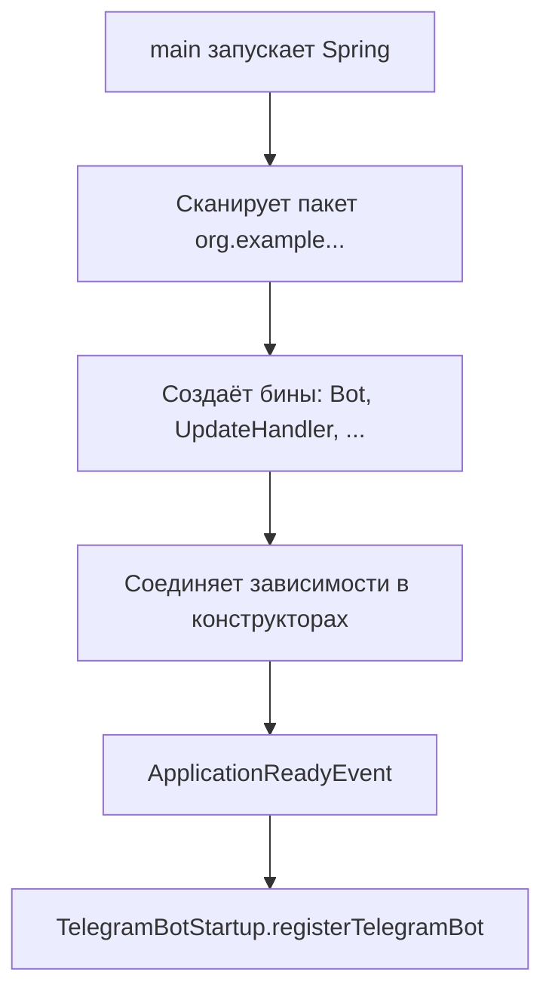
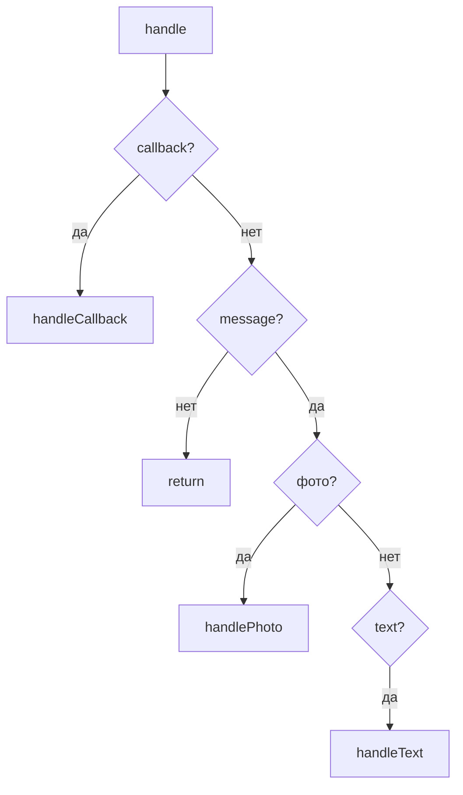
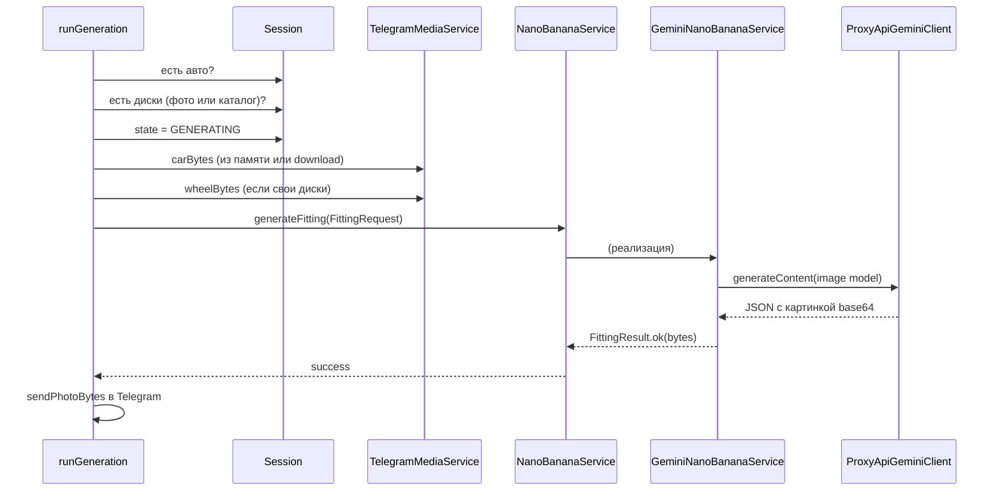

# AiTuningBot — ПОДРОБНЫЙ разбор (каждый класс, каждый вызов)

> Это **вторая часть** документации. Первая — обзор: [PROJECT-GUIDE.md](./PROJECT-GUIDE.md).  
> Здесь — **максимальная детализация**: что делает каждая строка логики, почему так, примеры JSON, таблицы «кто кого дергает».

---

## Оглавление

1. [Как Spring собирает приложение (на пальцах)](#1-как-spring-собирает-приложение-на-пальцах)
2. [Старт: от main до первого сообщения](#2-старт-от-main-до-первого-сообщения)
3. [Bot.java — построчно](#3-botjava--построчно)
4. [UpdateHandler — полный разбор](#4-updatehandler--полный-разбор)
5. [Все кнопки и callback — таблица](#5-все-кнопки-и-callback--таблица)
6. [Сессия: что где лежит и когда меняется](#6-сессия-что-где-лежит-и-когда-меняется)
7. [TelegramMediaService и TelegramMessageSender](#7-telegrammediaservice-и-telegrammessagesender)
8. [KeyboardFactory — какие кнопки куда](#8-keyboardfactory--какие-кнопки-куда)
9. [AI: ProxyApiGeminiClient — HTTP и JSON](#9-ai-proxyapigeminiclient--http-и-json)
10. [AI: GeminiImageValidationService — каждый шаг](#10-ai-geminiimagevalidationservice--каждый-шаг)
11. [AI: GeminiNanoBananaService — каждый шаг](#11-ai-gemininanobananaservice--каждый-шаг)
12. [Заглушки — когда и зачем](#12-заглушки--когда-и-зачем)
13. [Три сценария от начала до конца (пошагово)](#13-три-сценария-от-начала-до-конца-пошагово)

---

## 1. Как Spring собирает приложение (на пальцах)

Представь **офис**:

- На двери класса написано `@Service` или `@Component` → Spring говорит: «это сотрудник, я его найму».
- В конструкторе написано `public UpdateHandler(ImageValidationService v, ...)` → Spring **сам подставит** нужную реализацию.
- `@ConditionalOnProperty` → «нанимай этого сотрудника только если в yaml включено `bot.ai.enabled=true`».



**Почему `UpdateHandler` не знает про Gemini?**  
Он просит интерфейс `ImageValidationService`. Spring смотрит yaml:

- `enabled: true` → в контейнере есть **только** `GeminiImageValidationService`.
- `enabled: false` → **только** `StubImageValidationService`.

Два бина на один интерфейс **одновременно** не живут — иначе Spring не знал бы, кого вставить.

**Почему `@Lazy` на `UpdateHandler` в `Bot`?**  
`Bot` и `UpdateHandler` ссылаются друг на друга (цикл). `@Lazy` говорит: «создай UpdateHandler позже, когда реально понадобится» — иначе Spring может упасть при старте.

---

## 2. Старт: от main до первого сообщения

### Шаг 1 — `TelgramBotAiAssistantApplication.main`

```java
SpringApplication.run(TelgramBotAiAssistantApplication.class, args);
```

- Поднимается встроенный Tomcat (порт 8080 из yaml — но для бота он почти не нужен).
- Читается `application.yaml`.
- Создаются все `@Service`, `@Component`, `@Bean`.

### Шаг 2 — `TelegramBotStartup.registerTelegramBot`

Срабатывает **после** того, как Spring полностью готов (`ApplicationReadyEvent`).

```java
TelegramBotsApi botsApi = new TelegramBotsApi(DefaultBotSession.class);
botsApi.registerBot(bot);
```

- Регистрируем наш `Bot` в Telegram.
- Дальше библиотека **сама опрашивает** сервер Telegram (long polling): «есть новые сообщения?»
- Когда есть — вызывает `Bot.onUpdateReceived(update)`.

### Шаг 3 — цикл жизни одного сообщения

```
Telegram сервер
    → DefaultBotSession (библиотека)
    → Bot.onUpdateReceived(Update)
    → UpdateHandler.handle(Update)
    → (сессия / валидация / AI / sendMessage)
```

---

## 3. Bot.java — построчно

| Строка / блок | Что происходит | Зачем |
|---------------|----------------|--------|
| `extends TelegramLongPollingBot` | Класс из библиотеки telegrambots | Готовая логика long polling |
| `@Value("${token_bot}")` | Spring подставляет токен из yaml | Секрет не в коде |
| `super(telegramOptions(), botToken)` | Передаём токен родителю | Без токена API не пустит |
| `NO_PROXY` | Java HTTP **без** системного прокси | Иначе из РФ/VPN часто timeout к api.telegram.org |
| `onUpdateReceived` | try/catch вокруг `updateHandler.handle` | Один упавший update не убьёт весь бот |
| `getBotUsername` | Имя `@Joker747_bot` из yaml | Для логов и регистрации |

**Важно:** `Bot` **ничего не решает** про меню. Только передаёт `Update` дальше.

---

## 4. UpdateHandler — полный разбор

`UpdateHandler` — **единственное место**, где собран сценарий пользователя.

### 4.1. Зависимости конструктора (что внедрили и зачем)

| Поле | Класс | Роль в жизни UpdateHandler |
|------|--------|------------------------------|
| `sessionService` | `UserSessionService` | Память: есть ли авто, какой state |
| `imageValidationService` | `ImageValidationService` | Проверка фото (AI или заглушка) |
| `nanoBananaService` | `NanoBananaService` | Примерка (AI или заглушка) |
| `telegramMediaService` | `TelegramMediaService` | Скачать байты картинки из Telegram |
| `messageSender` | `TelegramMessageSender` | Отправить текст/фото пользователю |
| `keyboards` | `KeyboardFactory` | Собрать Reply/Inline клавиатуры |
| `bot` | `Bot` | Только для `answerCallbackQuery` |

---

### 4.2. Метод `handle(Update update)` — диспетчер

```java
public void handle(Update update) {
```

**Update** — пакет от Telegram. Внутри может быть:
- обычное сообщение (`message`),
- нажатие inline-кнопки (`callbackQuery`),
- и ещё куча типов (мы их игнорируем).

**Порядок проверок — намеренный:**

1. **`hasCallbackQuery()`** — сначала кнопки под сообщением.  
   Потому что callback тоже может теоретически тащить message, но логика другая.

2. **`hasMessage()`** — если нет message, выходим (нечего обрабатывать).

3. **Фото или image/document** → `handlePhoto`.  
   Пользователь прислал картинку — это всегда загрузка авто/дисков, не текстовая команда.

4. **Текст** → `handleText`.  
   Кнопки нижнего меню в Telegram приходят как **текст** сообщения (например `"🚗 Авто"`).



---

### 4.3. Метод `handleText` — нижнее меню и /start

| Текст (константа MenuText) | Метод | Что происходит с state |
|----------------------------|--------|-------------------------|
| `/start`, «Главное меню», «Назад в главное меню» | `showWelcome` | `MAIN_MENU` |
| «Загрузить свой авто», «📸 Загрузить новое авто», «Назад к выбору авто» | `requestCarPhoto` | `WAITING_CAR_PHOTO` |
| «Загрузить диски…», «💿 Диски», «Загрузка Дисков» | `openDiskFlow` | `DISK_MENU` или просьба сначала авто |
| «🚗 Авто» | `showCarSection` | меню авто |
| «🗑 Удалить авто» | inline «Подтвердить удаление» | — |
| Premium / Результаты / Профиль | show* методы | в основном `MAIN_MENU` |
| Любой другой текст | «Используйте кнопки…» | — |

**Почему switch по строкам?**  
Reply-кнопки не шлют `callback_data` — только текст. Поэтому сравниваем с `MenuText.BTN_*`.

---

### 4.4. Метод `handlePhoto` — самая важная логика для AI

Разберём **по строкам** (логическим блокам).

#### Блок A — подготовка

```java
UserSession session = sessionService.getOrCreate(chatId);
```
Достаём «блокнот» этого чата. Если первый раз — создаётся пустой.

```java
var photoOpt = telegramMediaService.extractLargestPhoto(message);
```
Из сообщения берём **самое большое** превью (Telegram шлёт несколько размеров).

#### Блок B — что мы вообще ждём от пользователя?

```java
ImageType expectedType = resolveExpectedImageType(session, state);
```

Смотри таблицу в [разделе 6](#6-сессия-что-где-лежит-и-когда-меняется).

- Если `expectedType == null` → пользователь кинул фото **не в тот момент** (не нажал «загрузить авто»). Бот отвечает: «Сначала выберите действие в меню».

- Если уже есть авто и state не `WAITING_CAR_PHOTO`, а тип CAR — «Авто уже сохранено…».

#### Блок C — скачивание и валидация

```java
byte[] bytes = telegramMediaService.downloadFile(photo.fileId());
```
`fileId` — не URL. Это id файла в Telegram. Мы:
1. `GetFile` через API → получаем путь на CDN Telegram.
2. HTTP GET `https://api.telegram.org/file/bot<token>/<path>` → байты в память.

```java
ValidationResult validation = imageValidationService.validate(bytes, photo.mimeType(), expectedType);
```

**Вот здесь вызывается AI** (если `bot.ai.enabled=true`):

- Spring вставил `GeminiImageValidationService`.
- Тот внутри зовёт `ProxyApiGeminiClient` → ProxyAPI → Gemini.

Если `valid == false` → `BotMessages.validationFailed(message)` и **return** (фото не сохраняем).

#### Блок D — сохранение после успеха

**Если CAR:**
```java
sessionService.saveCar(chatId, photo.fileId(), bytes);
```
- Пишет fileId и bytes в сессию.
- **Сбрасывает** выбор дисков (`clearWheelSelection`).
- Ставит `state = DISK_MENU`.

**Если WHEEL:**
```java
session.setCustomWheelPhotoFileId(...);
session.setCustomWheelImageBytes(bytes);
session.setSelectedCatalogWheel(null);  // свои диски заменяют каталог
session.setState(BotState.WHEEL_READY);
```
Показывает inline «Примерка» / «Другие диски».

---

### 4.5. Метод `handleCallback` — inline-кнопки

**Первое действие всегда:**
```java
answerCallback(callback.getId());
```
Убирает «часики» на кнопке у пользователя. Без этого Telegram крутит загрузку.

Дальше — цепочка `if` по `callback.getData()` (строка вроде `start_fitting`).

| `data` | Действие |
|--------|----------|
| `delete_car` | `sessionService.deleteCar` |
| `cancel_delete_car` | `showCarSection` |
| `back_disk_menu` | `openDiskFlow` |
| `open_catalog` / `back_catalog` | каталог дисков, state `WHEEL_CATALOG` |
| `show_more_catalog` | текст-заглушка «ещё диски» |
| `custom_wheel` / `reload_wheel` | state `WAITING_WHEEL_PHOTO`, ждём фото |
| `catalog:<id>` | выбор диска из enum, state `WHEEL_SELECTED` |
| `start_fitting` / `fit_custom_wheel` | **`runGeneration`** ← AI генерация |
| `try_other_wheels` | снова меню дисков |
| premium/results/profile кнопки | заглушки / назад |

**Почему `catalog:` с префиксом?**  
Одна кнопка = одна строка `data` (до 64 байт). Вместо 4 разных handler'ов: `data.startsWith("catalog:")` + `wheelId = data.substring(...)`.

---

### 4.6. Метод `runGeneration` — примерка



**Построчно:**

1. Нет авто → `requestCarPhoto`.
2. Нет дисков → `openDiskFlow`.
3. `session.setState(GENERATING)` — чтобы `resolveExpectedImageType` не путал фото во время генерации.
4. Собираем `FittingRequest`:
   - `carBytes` — из сессии, если пусто — качаем по `carPhotoFileId`.
   - `wheelBytes` — только если пользователь **загружал свои** диски. Для каталога `wheelBytes = null`, в AI уйдёт только название диска в тексте промпта.
   - `catalogWheel` — enum или null.
5. `nanoBananaService.generateFitting(request)` → внутри Gemini, 10–60+ секунд.
6. Ошибка → текст `generationFailed`, state `DISK_MENU`.
7. Успех → `sendPhotoBytes`, state `RESULT`, inline кнопки результата.

---

### 4.7. Вспомогательные методы

| Метод | Зачем |
|-------|--------|
| `showWelcome` | 2 сообщения: приветствие + нижнее меню |
| `requestCarPhoto` | state `WAITING_CAR_PHOTO` + инструкция |
| `showCarSection` | меню «авто сохранено / нет» |
| `openDiskFlow` | если нет авто — просит авто; иначе inline «каталог / свои диски» |
| `ensureCarOrAsk` | guard перед каталогом и дисками |
| `resolveExpectedImageType` | см. раздел 6 |
| `answerCallback` | убрать часики на кнопке |

---

## 5. Все кнопки и callback — таблица

### Нижнее меню (Reply) → `handleText`

| Кнопка | Константа | Handler |
|--------|-----------|---------|
| 👑 Premium | `BTN_PREMIUM` | `showPremium` |
| 🚗 Авто | `BTN_AUTO` | `showCarSection` |
| 💿 Диски | `BTN_DISKS` | `openDiskFlow` |
| ✨ Результаты | `BTN_RESULTS` | `showResults` |
| 👤 Профиль | `BTN_PROFILE` | `showProfile` |

### Inline → `handleCallback`

| Подпись (пример) | callback_data | Handler |
|------------------|---------------|---------|
| Примерка | `start_fitting` | `runGeneration` |
| Примерка (свои диски) | `fit_custom_wheel` | `runGeneration` |
| BBS LM | `catalog:bbs_lm` | выбор каталога |
| Свои диски | `custom_wheel` | ждём фото |
| Каталог | `open_catalog` | список дисков |
| Удалить авто | `delete_car` | удаление |

---

## 6. Сессия: что где лежит и когда меняется

### `resolveExpectedImageType` — мозг «что за фото ждём»

```java
return switch (state) {
    case WAITING_CAR_PHOTO -> ImageType.CAR;
    case WAITING_WHEEL_PHOTO, DISK_MENU, WHEEL_CATALOG, WHEEL_SELECTED, WHEEL_READY -> ImageType.WHEEL;
    case MAIN_MENU, RESULT, GENERATING -> session.hasSavedCar() ? null : ImageType.CAR;
    default -> null;
};
```

| state | Ожидаем фото | Пояснение |
|-------|--------------|-----------|
| `WAITING_CAR_PHOTO` | CAR | Пользователь нажал «загрузить авто» |
| `WAITING_WHEEL_PHOTO` | WHEEL | Ждём фото дисков |
| `DISK_MENU`, `WHEEL_CATALOG`, `WHEEL_SELECTED`, `WHEEL_READY` | WHEEL | В потоке дисков любое фото = диск |
| `MAIN_MENU` без авто | CAR | Можно сразу кинуть авто с главной |
| `MAIN_MENU` с авто | null | Сначала нажми кнопку |
| `GENERATING`, `RESULT` | null | Сейчас не время для фото |

### Таблица изменений сессии

| Событие | carPhotoFileId | carImageBytes | wheel | catalog | state после |
|---------|----------------|---------------|-------|---------|-------------|
| saveCar | ✅ | ✅ | сброс | сброс | DISK_MENU |
| deleteCar | ❌ | ❌ | сброс | сброс | MAIN_MENU |
| фото дисков OK | — | — | ✅ bytes | null | WHEEL_READY |
| выбор каталога | — | — | null | ✅ enum | WHEEL_SELECTED |

**Почему храним и fileId и bytes?**  
- `bytes` — сразу отдаём в AI без повторного скачивания.  
- `fileId` — если bytes потерялись, можно скачать снова через Telegram.

---

## 7. TelegramMediaService и TelegramMessageSender

### extractLargestPhoto

1. `message.hasPhoto()` → список `PhotoSize`, берём max по `fileSize`.
2. Иначе `hasDocument()` и mime `image/*` → документ как картинка.
3. Иначе `Optional.empty()`.

Возвращает `PhotoPayload(fileId, mimeType)`.

### downloadFile

```
fileId
  → bot.execute(GetFile)  // Telegram Bot API
  → filePath на серверах Telegram
  → GET https://api.telegram.org/file/bot{token}/{filePath}
  → byte[]
```

Используется **`telegramRestTemplate`** с `Proxy.NO_PROXY` — отдельно от AI.

### TelegramMessageSender

| Метод | API Telegram | Когда |
|-------|--------------|-------|
| `sendText` | SendMessage + ReplyKeyboard | нижнее меню |
| `sendTextWithInline` | SendMessage + InlineKeyboard | каталог, подтверждения |
| `sendPhotoBytes` | SendPhoto + InputFile(stream) | результат примерки |

---

## 8. KeyboardFactory — какие кнопки куда

Класс **не** импортирует handler. Только собирает разметку.

Примеры:

- `mainMenuKeyboard()` — 3 ряда: Premium+Авто, Диски+Результаты, Профиль.
- `catalogInline()` — по одной кнопке на каждый `WheelCatalogItem`, `callback_data = "catalog:" + id`.
- `wheelConfirmInline()` — «Примерка» → `start_fitting`.
- `customWheelReadyInline()` — «Примерка» → `fit_custom_wheel`.

**Правило:** текст на кнопке может быть любым, **логика всегда по `callback_data`**, не по подписи.

---

## 9. AI: ProxyApiGeminiClient — HTTP и JSON

### Один запрос — из чего состоит

**URL:**
```
{base-url}/v1beta/models/{model}:generateContent
```
Пример:
```
https://api.proxyapi.ru/google/v1beta/models/gemini-2.5-flash:generateContent
```

**Заголовки:**
```
Content-Type: application/json
Authorization: Bearer sk-...
```

**Тело (упрощённо):**
```json
{
  "contents": [
    {
      "role": "user",
      "parts": [
        { "inlineData": { "mimeType": "image/jpeg", "data": "<BASE64>" } },
        { "text": "Твой промпт..." }
      ]
    }
  ],
  "generationConfig": { ... }
}
```

### generateContent — что делает код

1. Склеить URL из `BotProperties.ai.baseUrl` + model.
2. `authHeaders()` — Bearer ключ.
3. `restTemplate.postForEntity` — синхронный HTTP POST (поток Telegram **ждёт** ответа).
4. `objectMapper.readTree(body)` — JSON в дерево `JsonNode`.

### extractImageBytes

Идёт по `candidates[].content.parts[]`:
- ищет `inlineData.data` (или snake_case `inline_data`),
- декодирует Base64 → `byte[]`.

### extractText

Склеивает все `parts[].text` из первого candidate.

### Почему отдельный RestTemplate на 180 секунд?

Генерация картинки может идти **минуту**. Обычный timeout 30 сек оборвал бы запрос.

---

## 10. AI: GeminiImageValidationService — каждый шаг

### validate() — входная точка

```
1. BasicImageValidator (локально, бесплатно)
2. resolveApiKey() — есть ключ?
3. цикл попыток (maxRetries из yaml, по умолчанию 0)
4. validateWithGemini()
5. при ошибке — handleApiError → понятный текст юзеру
```

### validateWithGemini() — тело запроса

| Поле JSON | Значение |
|-----------|----------|
| contents | картинка + промпт (CAR или WHEEL) |
| generationConfig.temperature | 0.1 (меньше фантазий) |
| generationConfig.responseMimeType | application/json |

Модель: `bot.ai.validation-model` → `gemini-2.5-flash`.

### parseValidationAnswer

1. Пытается распарсить JSON целиком.
2. Если Gemini обернул в ``` markdown — `stripMarkdown` вырезает.
3. Запасной вариант — regex `"valid": true/false`.

### Промпты (смысл)

- **CAR:** на фото должна быть машина целиком, не логотип, не интерьер.
- **WHEEL:** должен быть диск, не вся машина.

---

## 11. AI: GeminiNanoBananaService — каждый шаг

### generateFitting()

Проверки до сети:
- есть car bytes?
- есть wheel bytes **или** catalog?
- есть api key?

### generateWithGemini() — parts

| # | Part | Когда |
|---|------|--------|
| 1 | inlineImage — авто | всегда |
| 2 | inlineImage — диски | если пользователь загрузил своё фото |
| 3 | text — промпт | всегда |

**generationConfig:**
```json
"responseModalities": ["IMAGE"]
```
Без этого модель может ответить текстом «я бы поставил такие диски…» без картинки.

Модель: `gemini-2.5-flash-image`.

### buildPrompt — логика текста

- Каталог: `"диски из каталога: BBS LM"` — **без картинки диска**, только название.
- Свои диски: `"диски со второго приложенного фото"` — вторая картинка в запросе.

### Ответ

- Успех: `FittingResult.ok(imageBytes)`.
- Нет картинки в ответе: fail «Модель не вернула изображение».

---

## 12. Заглушки — когда и зачем

| Класс | enabled=false | Поведение |
|-------|---------------|-----------|
| `StubImageValidationService` | да | только размер/MIME |
| `StubNanoBananaService` | да | возвращает **исходное фото авто** без AI |

Нужны чтобы:
- разрабатывать меню без траты денег на API;
- тестировать Telegram без интернета к Gemini.

---

## 13. Три сценария от начала до конца (пошагово)

### Сценарий A: каталог + примерка

| # | Пользователь | Код |
|---|--------------|-----|
| 1 | /start | `handleText` → `showWelcome`, state MAIN_MENU |
| 2 | «Загрузить авто» | `requestCarPhoto`, WAITING_CAR_PHOTO |
| 3 | фото машины | `handlePhoto` → validate CAR → `saveCar`, DISK_MENU |
| 4 | «💿 Диски» | `openDiskFlow` |
| 5 | inline «Каталог» | `handleCallback` OPEN_CATALOG, WHEEL_CATALOG |
| 6 | inline «BBS LM» | `catalog:bbs_lm`, WHEEL_SELECTED |
| 7 | inline «Примерка» | `runGeneration` → Gemini image → sendPhotoBytes |

### Сценарий B: свои диски

| # | Пользователь | Код |
|---|--------------|-----|
| 1–3 | как выше | авто сохранено |
| 4 | inline «Свои диски» | CUSTOM_WHEEL, WAITING_WHEEL_PHOTO |
| 5 | фото диска | validate WHEEL, WHEEL_READY |
| 6 | «Примерка» | FIT_CUSTOM_WHEEL → runGeneration с **двумя** картинками в AI |

### Сценарий C: AI выключен

| # | yaml | Что будет |
|---|------|-----------|
| 1 | `bot.ai.enabled: false` | Stub валидация + Stub генерация |
| 2 | фото авто | только размер файла |
| 3 | примерка | вернётся **то же** фото авто |

---

## Шпаргалка «один вопрос — один ответ»

| Вопрос | Ответ |
|--------|--------|
| Кто первый получает сообщение? | `Bot.onUpdateReceived` |
| Кто решает сценарий? | `UpdateHandler` |
| Кто шлёт HTTP в Gemini? | **Только** `ProxyApiGeminiClient` |
| Кто валидирует? | `GeminiImageValidationService` (через клиент) |
| Кто рисует примерку? | `GeminiNanoBananaService` (через клиент) |
| Где ключ? | `application.yaml` → `BotProperties` |
| Где память юзера? | `UserSessionService` / `UserSession` |
| Почему два RestTemplate? | Telegram без прокси, AI с длинным timeout |

---

*Если что-то в коде переименуешь — обнови этот файл. Обзорная карта — в [PROJECT-GUIDE.md](./PROJECT-GUIDE.md).*
