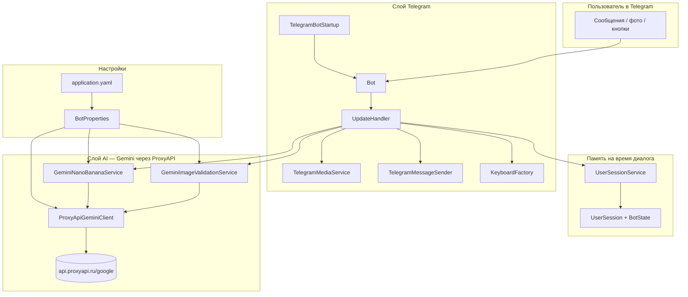
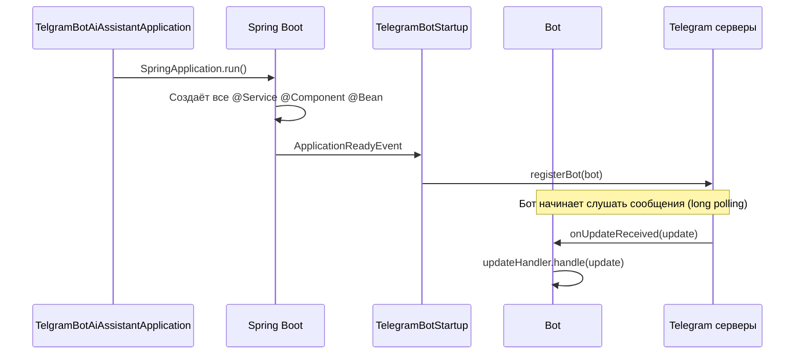
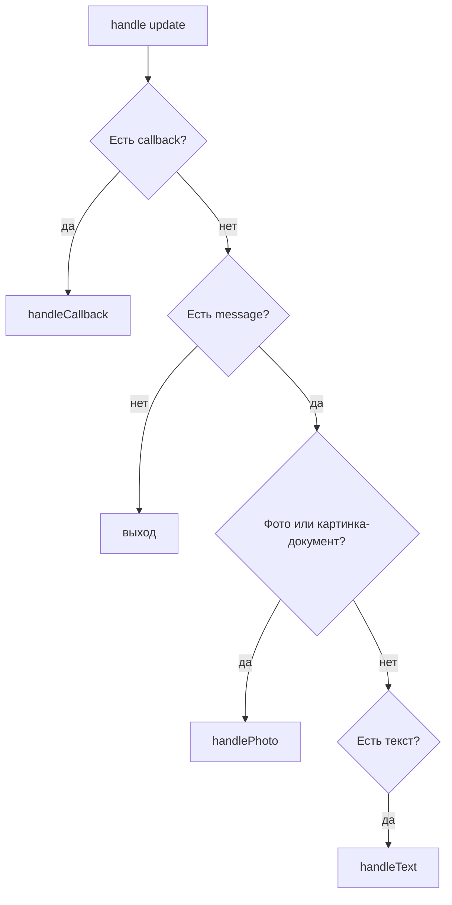
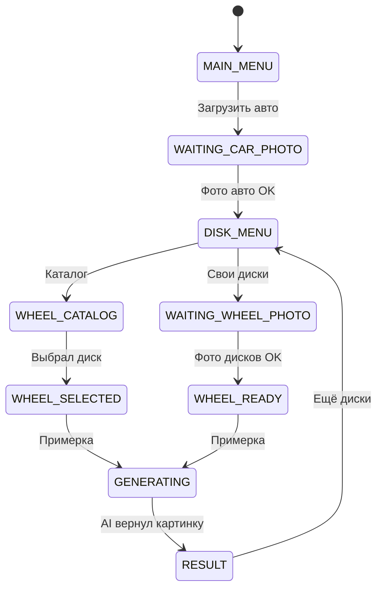
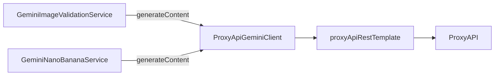
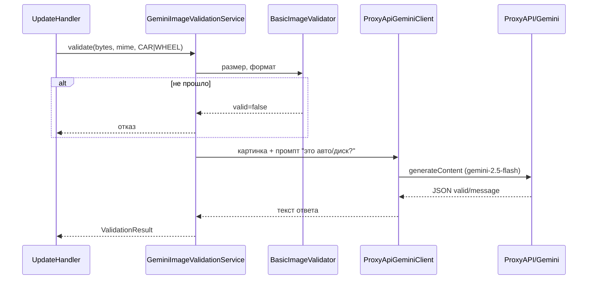
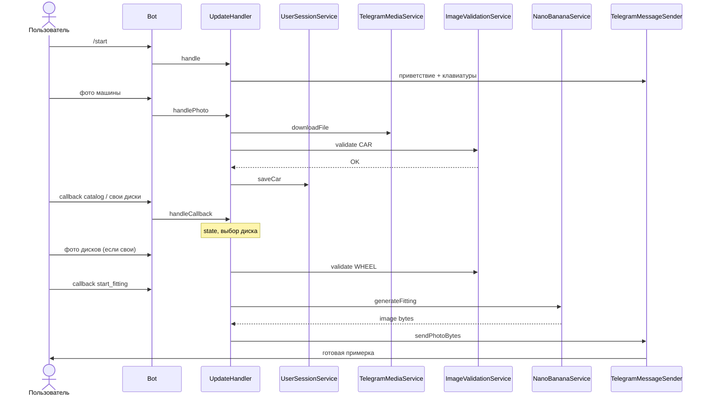
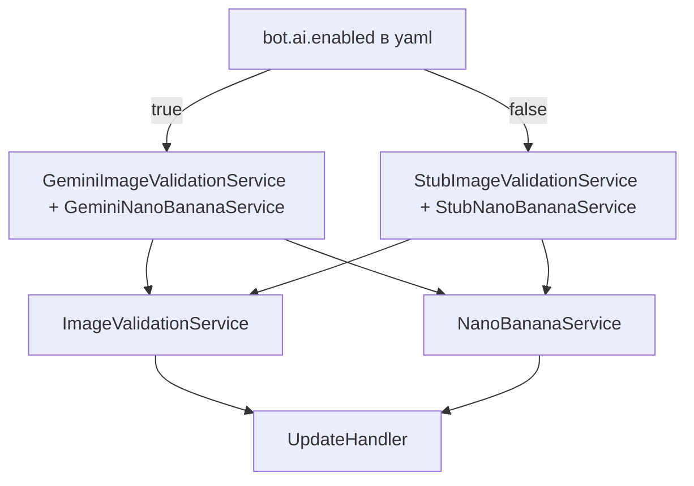

# AiTuningBot — полный гид по проекту

> Документация «от корки до корки»: что за бот, какие классы есть, кто кого вызывает и зачем так сделано.  
> Язык — максимально простой, как объяснение другу за пивом.

---

## ⚠️ Нужно ПОДРОБНО — построчно, каждый метод?

**Обзор и схемы — этот файл.**  
**Разжёвано до каждого вызова, таблицы callback, JSON в API, сценарии A/B/C:**

### 👉 [PROJECT-GUIDE-DETAILED.md](./PROJECT-GUIDE-DETAILED.md) ← открывай это

Там ~600+ строк: `UpdateHandler` по блокам, `resolveExpectedImageType`, что уходит в ProxyAPI, зачем `@Lazy`, и т.д.

---

## 1. Что это вообще такое?

**AiTuningBot** — Telegram-бот на **Spring Boot** (Java 17).

Пользователь:
1. Загружает **фото машины**.
2. Выбирает **диски** (из каталога или своё фото).
3. Жмёт **«Примерка»**.
4. Получает **картинку**, где AI «поставил» диски на его авто.

Две «магии» снаружи:
- **Telegram** — чат, кнопки, фото.
- **Gemini через ProxyAPI** — проверка фото и генерация картинки (без VPN, оплата в рублях).

Внутри бота всё разложено по **папкам-пакетам** — как отделы в офисе.

---

## 2. Карта проекта одним взглядом



**Главное правило:** `UpdateHandler` — **мозг меню**. Он не знает слов «Gemini» и «ProxyAPI». Он зовёт только интерфейсы `ImageValidationService` и `NanoBananaService`. Spring сам подставляет «настоящий AI» или «заглушку».

---

## 3. Как программа просыпается (старт)



### Классы старта

| Класс | Папка | Зачем |
|-------|--------|--------|
| `TelgramBotAiAssistantApplication` | корень | Точка входа `main()` — только запускает Spring. **Не** регистрирует бота (это делает `TelegramBotStartup`). |
| `TelegramBotStartup` | `configuration` | Когда Spring готов — регистрирует бота в Telegram API. |
| `Bot` | корень | «Уши» бота: получает `Update` от Telegram и передаёт в `UpdateHandler`. |
| `AiTuningBotConfig` | `configuration` | Включает чтение `BotProperties` + бин `ObjectMapper`. |
| `application.yaml` | `resources` | Токен бота, имя, настройки AI (ключ ProxyAPI, модели). |

---

## 4. Дерево папок (все Java-классы)

```
src/main/java/org/example/telgrambotaiassistant/
├── TelgramBotAiAssistantApplication.java   ← main
├── Bot.java                                 ← Telegram long polling
│
├── configuration/                           ← настройки Spring
│   ├── AiTuningBotConfig.java
│   ├── BotProperties.java
│   ├── TelegramBotStartup.java
│   ├── TelegramRestTemplateConfig.java
│   ├── ProxyApiGeminiRestTemplateConfig.java
│   └── RestTemplateConfig.java
│
├── handler/                                 ← логика меню и сценариев
│   ├── UpdateHandler.java
│   ├── MenuText.java
│   └── CallbackAction.java
│
├── session/                                 ← что помним о пользователе
│   ├── UserSession.java
│   ├── UserSessionService.java
│   └── BotState.java
│
├── keyboard/                                ← кнопки
│   └── KeyboardFactory.java
│
├── text/                                    ← тексты сообщений
│   └── BotMessages.java
│
├── catalog/                                 ← список дисков в каталоге
│   └── WheelCatalogItem.java
│
├── telegram/                                ← отправка в Telegram, скачивание файлов
│   ├── TelegramMessageSender.java
│   └── TelegramMediaService.java
│
├── validation/                              ← проверка фото
│   ├── ImageValidationService.java        (интерфейс)
│   ├── GeminiImageValidationService.java  (AI)
│   ├── StubImageValidationService.java    (заглушка)
│   ├── BasicImageValidator.java
│   ├── ImageType.java
│   └── ValidationResult.java
│
├── generation/                              ← примерка (картинка)
│   ├── NanoBananaService.java               (интерфейс)
│   ├── GeminiNanoBananaService.java         (AI)
│   ├── StubNanoBananaService.java           (заглушка)
│   ├── FittingRequest.java
│   └── FittingResult.java
│
└── gemini/                                  ← общий HTTP-клиент к ProxyAPI
    └── ProxyApiGeminiClient.java
```

---

## 5. Слой Telegram — «лицо» бота

### `Bot.java`

- Наследует `TelegramLongPollingBot` (библиотека `telegrambots`).
- В конструкторе: токен и имя из `application.yaml` (`token_bot`, `name_bot`).
- **`NO_PROXY`** — чтобы Java не лезла в системный SOCKS/VPN и не отваливалась на `api.telegram.org`.
- Метод `onUpdateReceived` → один вызов: `updateHandler.handle(update)`.

### `UpdateHandler.java` — **главный режиссёр**

Вход: `handle(Update update)`.



**Три типа событий:**

| Событие | Метод | Примеры |
|---------|--------|---------|
| Нажата inline-кнопка | `handleCallback` | `start_fitting`, `catalog:bbs_lm` |
| Текст / кнопка меню | `handleText` | `/start`, «🚗 Авто», «💿 Диски» |
| Фото | `handlePhoto` | машина или диск |

**Зависимости (что внедряется в конструктор):**

| Поле | Роль |
|------|------|
| `sessionService` | Память пользователя |
| `imageValidationService` | Проверка фото (AI или заглушка) |
| `nanoBananaService` | Генерация примерки |
| `telegramMediaService` | Скачать файл из Telegram |
| `messageSender` | Отправить текст/фото |
| `keyboards` | Собрать клавиатуры |
| `bot` | Ответить на callback (`answerCallbackQuery`) |

### `TelegramMediaService.java`

- `extractLargestPhoto` — из сообщения достаёт самое большое фото (или картинку-документ).
- `downloadFile(fileId)` — через Telegram API получает путь и качает байты по HTTP (`telegramRestTemplate` **без прокси**).

### `TelegramMessageSender.java`

Обёртка над `bot.execute(...)`:
- `sendText` / `sendTextWithInline` — сообщения + клавиатура.
- `sendPhotoBytes` — отправить картинку из памяти (результат примерки).

### `KeyboardFactory.java`

Только **рисует кнопки** — не решает бизнес-логику.
- Нижнее меню: Premium, Авто, Диски, Результаты, Профиль.
- Inline: каталог дисков, «Примерка», «Назад» и т.д.
- Тексты кнопок берёт из `MenuText`, callback-ид из `CallbackAction`.

### `MenuText.java` / `CallbackAction.java`

Константы — чтобы не плодить опечатки в строках:
- `MenuText.BTN_AUTO` = `"🚗 Авто"`
- `CallbackAction.START_FITTING` = `"start_fitting"`

### `BotMessages.java`

Все длинные тексты для пользователя («Добро пожаловать», «Генерируем…»).

---

## 6. Память пользователя (сессия)

Бот **не база данных** — пока он запущен, данные лежат в `ConcurrentHashMap` в RAM.

### `UserSession` — «блокнот одного чата»

| Поле | Что хранит |
|------|------------|
| `chatId` | ID чата Telegram |
| `state` | На каком шаге меню человек (`BotState`) |
| `carPhotoFileId` / `carImageBytes` | Сохранённое авто |
| `customWheelPhotoFileId` / `customWheelImageBytes` | Свои диски |
| `selectedCatalogWheel` | Диск из каталога (enum) |
| `lastResultPhotoFileId` | Зарезервировано под историю |

### `BotState` — «где мы в сценарии»



### `UserSessionService`

- `getOrCreate(chatId)` — достать или создать сессию.
- `saveCar` — записать авто, сбросить выбор дисков, `state = DISK_MENU`.
- `deleteCar` — очистить авто и диски.

---

## 7. Каталог дисков

### `WheelCatalogItem` (enum)

| id | Название |
|----|----------|
| `bbs_lm` | BBS LM |
| `rays_te37` | RAYS TE37 |
| `vossen_hf5` | VOSSEN HF-5 |
| `work_vs_xv` | WORK VS XV |

`findById` — когда пришёл callback `catalog:bbs_lm`, достаём enum для сессии и для промпта AI.

---

## 8. Слой AI — Gemini через ProxyAPI

### Почему не Google напрямую?

Из РФ `generativelanguage.googleapis.com` часто недоступен. **ProxyAPI** — посредник: тот же API Gemini, другой адрес, ключ в рублях.

Базовый URL: `https://api.proxyapi.ru/google`  
Метод: `POST .../v1beta/models/{модель}:generateContent`  
Заголовок: `Authorization: Bearer <ключ>`

### Настройки: `application.yaml` + `BotProperties`

```yaml
bot:
  ai:
    enabled: true
    api-key: ...
    base-url: https://api.proxyapi.ru/google
    validation-model: gemini-2.5-flash      # проверка фото (текст + vision)
    generation-model: gemini-2.5-flash-image  # выдаёт картинку
```

`BotProperties` — Java-объект, куда Spring мапит эти поля.

### Кто реально шлёт HTTP в интернет?

**Только `ProxyApiGeminiClient`.**  
Остальные сервисы говорят ему: «вот JSON, вот модель — отправь».



**`ProxyApiGeminiRestTemplateConfig`** — отдельный HTTP-клиент с таймаутом чтения **180 сек** (генерация картинки долгая).

### `ProxyApiGeminiClient` — что умеет

| Метод | Зачем |
|-------|--------|
| `generateContent(model, body)` | POST в API, вернуть JSON |
| `inlineImagePart(bytes, mime)` | Картинка в base64 для тела запроса |
| `textPart(text)` | Текстовая часть |
| `userContent(parts...)` | Собрать `contents` как у Gemini |
| `extractText(response)` | Достать текст (для валидации) |
| `extractImageBytes(response)` | Достать картинку из ответа |
| `resolveApiKey()` | Ключ из yaml или env |
| `isInsufficientBalance`, `isQuotaError`… | Понятные ошибки пользователю |

---

## 9. Валидация фото

### Интерфейс `ImageValidationService`

```java
ValidationResult validate(byte[] imageBytes, String mimeType, ImageType type);
```

`ImageType`: `CAR` или `WHEEL`.

### Две реализации (включается одна)

| Класс | Когда живёт | Что делает |
|-------|-------------|------------|
| `StubImageValidationService` | `bot.ai.enabled=false` (по умолчанию) | Только размер и MIME |
| `GeminiImageValidationService` | `bot.ai.enabled=true` | Локальная проверка + спросить Gemini |

Spring аннотация `@ConditionalOnProperty` — как выключатель на стене: включил `enabled: true` — заглушка **исчезает**, включается Gemini.

### Как работает `GeminiImageValidationService` (по шагам)



Промпт просит ответ **строго JSON**: `{"valid": true/false, "message": "..."}`.

### `BasicImageValidator`

Чистая Java без сети: минимум 5 КБ, максимум 15 МБ, `mime` начинается с `image/`.

### `ValidationResult`

Record: `valid` + `message`. Фабрики `ok()` / `fail(text)`.

---

## 10. Генерация примерки

### Интерфейс `NanoBananaService`

```java
FittingResult generateFitting(FittingRequest request);
```

### `FittingRequest` — что передаём в AI

| Поле | Откуда в UpdateHandler |
|------|-------------------------|
| `carImageBytes` | Сессия (или скачать по fileId) |
| `wheelImageBytes` | Свои диски, если есть |
| `catalogWheel` | Если выбрали из каталога |
| `prompt` | Пока `null` (запас на будущее) |

### `GeminiNanoBananaService`

1. Проверяет, что есть авто и (диск-фото **или** каталог).
2. Собирает parts: **фото авто** + опционально **фото дисков** + **текст-задание**.
3. В `generationConfig` ставит `responseModalities: ["IMAGE"]` — «верни картинку, не болтовню».
4. Модель: `gemini-2.5-flash-image`.
5. Из ответа `extractImageBytes` → `FittingResult.ok(bytes)`.

### `StubNanoBananaService`

Если AI выключен — просто **возвращает исходное фото авто** (чтобы меню можно было тестить без денег на API).

### `FittingResult`

`success` + `imageBytes` + `message`.

---

## 11. Полный путь пользователя (сквозной сценарий)



---

## 12. Слой configuration — все бины

| Класс | Что создаёт |
|-------|-------------|
| `AiTuningBotConfig` | `@EnableConfigurationProperties(BotProperties)`, `ObjectMapper` |
| `BotProperties` | Не бин сам по себе — объект настроек `bot.*` |
| `RestTemplateConfig` | Обычный `restTemplate` (общий) |
| `TelegramRestTemplateConfig` | `telegramRestTemplate` без прокси — для файлов Telegram |
| `ProxyApiGeminiRestTemplateConfig` | `proxyApiRestTemplate` — долгий таймаут для AI |
| `TelegramBotStartup` | Регистрация бота после старта Spring |

---

## 13. Заглушки vs AI — как Spring выбирает



**Почему так?**  
`UpdateHandler` пишется один раз. Завтра сменили API — меняем только реализацию интерфейса, не 400 строк меню.

---

## 14. Внешние зависимости (`pom.xml`)

| Библиотека | Зачем |
|------------|--------|
| `spring-boot-starter-webmvc` | Spring, веб, Jackson |
| `spring-boot-starter-restclient` | `RestTemplateBuilder` |
| `telegrambots` 6.9.7.1 | Telegram Bot API |
| `lombok` | Меньше boilerplate (`@Data`, `@Slf4j`) |

---

## 15. Конфигурационные файлы

| Файл | Назначение |
|------|------------|
| `application.yaml` | Реальные секреты (в `.gitignore`) |
| `application.yaml.example` | Шаблон для команды без ключей |
| `docs-obsidian/` | Дизайн меню (canvas), не код |

---

## 16. Шпаргалка «кто за что» (одна таблица)

| Вопрос | Ответ |
|--------|--------|
| Кто получает сообщение из Telegram? | `Bot.onUpdateReceived` |
| Кто решает, фото это или кнопка? | `UpdateHandler.handle` |
| Где хранится «у юзера есть авто»? | `UserSession` в `UserSessionService` |
| Кто рисует кнопки? | `KeyboardFactory` |
| Кто шлёт текст/фото в чат? | `TelegramMessageSender` |
| Кто качает файл с серверов Telegram? | `TelegramMediaService` |
| Кто проверяет фото? | `ImageValidationService` → Gemini или Stub |
| Кто делает примерку? | `NanoBananaService` → Gemini или Stub |
| **Кто один раз ходит в ProxyAPI/Gemini?** | **`ProxyApiGeminiClient`** |
| Где ключ и модели? | `application.yaml` → `BotProperties` |

---

## 17. Типичные ошибки и где смотреть лог

| Симптом | Где копать |
|---------|------------|
| Бот не стартует, ObjectMapper | `AiTuningBotConfig` — бин `ObjectMapper` |
| Telegram timeout | `Bot` / `TelegramRestTemplateConfig` — `NO_PROXY` |
| «Недостаточно средств» | Баланс на proxyapi.ru |
| «Model not supported» | Поменять модель в yaml (`gemini-2.5-flash`) |
| Фото не принимается | Лог `GeminiImageValidationService` |
| Нет картинки примерки | Лог `GeminiNanoBananaService`, таймаут 180с |

---

## 18. Куда развивать дальше (не сделано, но логично)

- Сохранять историю в «✨ Результаты» (сейчас заглушка).
- Premium / оплата — заглушки в `UpdateHandler`.
- Улучшить промпты в `GeminiNanoBananaService.buildPrompt`.
- База данных вместо `ConcurrentHashMap` для сессий.
- Картинки каталога дисков в промпт (сейчас только название enum).

---

*Документ актуален для структуры проекта AiTuningBot с интеграцией ProxyAPI + Gemini. Обновляй при добавлении новых пакетов или классов.*
